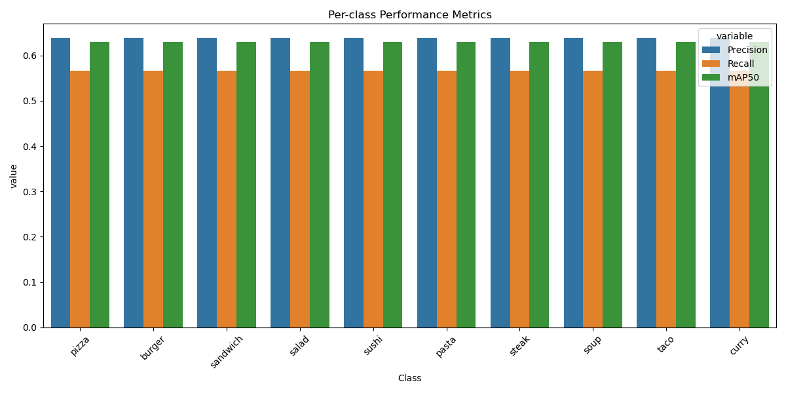
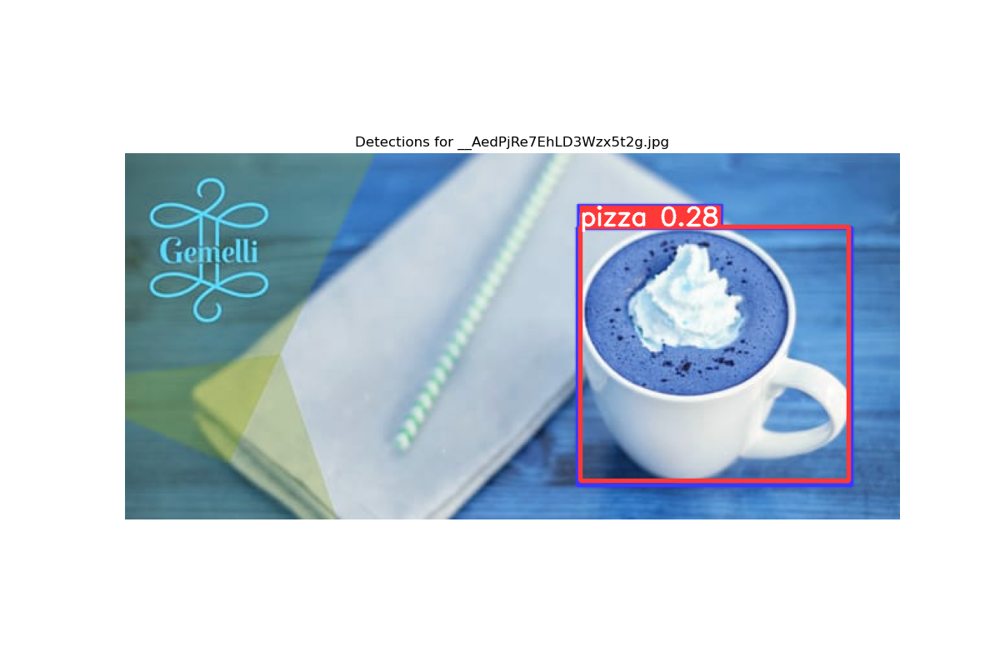
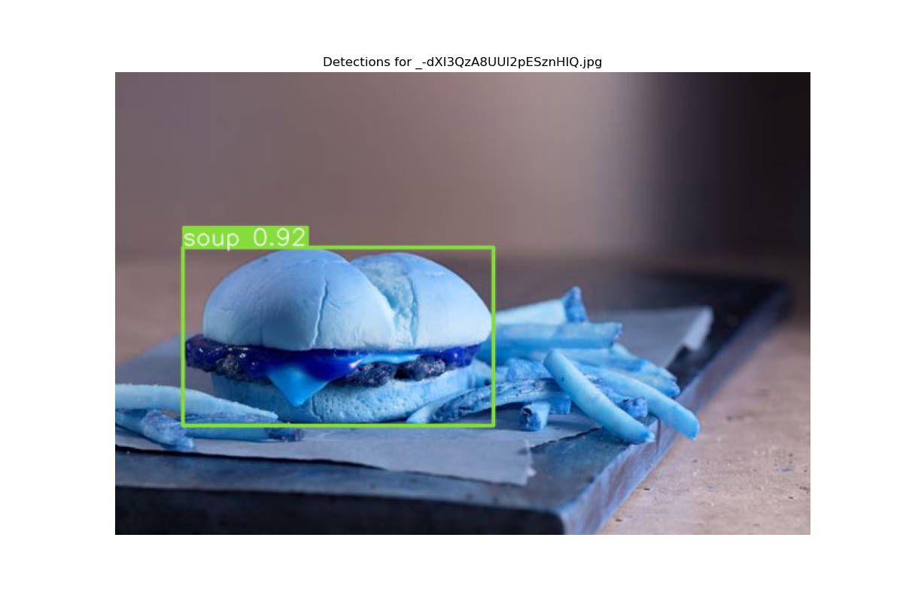
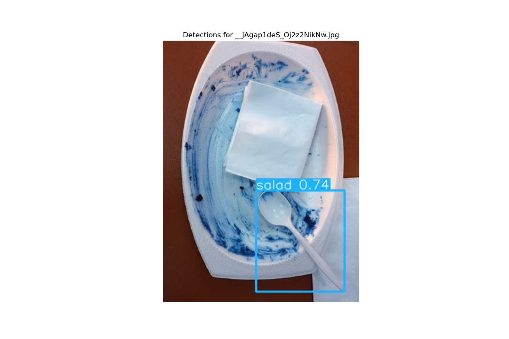

# Food Object Detection on CPU with YOLOv8

## Table of Contents
1. [Business Use Case](#business-use-case)
2. [Project Overview](#project-overview)  
3. [Data](#data)  
4. [Setup & Installation](#setup--installation)  
5. [Training the Model](#training-the-model)  
6. [Inference on CPU](#inference-on-cpu)  
7. [Deployment](#deployment)
8. [Results & Evaluation](#results--evaluation)  
9. [Project Structure](#project-structure)  


---

## Business Use Case
This project addresses several key business needs in the food industry:
- **Restaurant Menu Digitization**: Automatically identify and catalog food items from images
- **Food Delivery Apps**: Verify food item accuracy and presentation
- **Quality Control**: Ensure consistency in food presentation across chain restaurants
- **Customer Experience**: Enable visual search for food items
- **Inventory Management**: Track food items through visual identification
- **Nutritional Analysis**: Support automated food logging and dietary tracking

## Project Overview
This repository provides a complete solution for food object detection using YOLOv8, optimized for CPU deployment. The system can detect 10 food classes:
- Pizza 🍕
- Burger 🍔
- Sandwich 🥪
- Salad 🥗
- Pasta 🍝
- Sushi 🍱
- Steak 🥩
- Soup 🥣
- Taco 🌮
- Curry 🍛

**Key Features**:
- CPU-optimized implementation
- Production-ready Gradio web interface
- Docker containerization
- AWS deployment support
- Comprehensive evaluation metrics

**Performance Metrics**:
- mAP50: 0.630
- mAP50-95: 0.562
- Precision: 0.636
- Recall: 0.566

## Data Collection and Labeling

### Data Sources
- Images collected from various sources:
  - Yelp Dataset Challenge
  - Food101 Dataset
  - Custom web scraping (using `scripts/scrape_images.py`)
  - Manual collection for underrepresented classes

### Data Labeling Process
1. **Initial Automated Labeling**:
   - Used GroundingDINO for zero-shot detection (`scripts/grounding_dino_sam_infer.py`)
   - Generated initial bounding boxes for common food items
   - Confidence threshold set to 0.25 to capture more potential objects

2. **Manual Verification and Correction**:
   - Used CVAT (Computer Vision Annotation Tool) for verification
   - Corrected bounding boxes and class labels
   - Added missing annotations
   - Removed false positives

3. **Label Format Conversion**:
   - Converted CVAT exports to YOLO format (`scripts/convert_labels.py`)
   - Each label file contains: `<class_id> <x_center> <y_center> <width> <height>`
   - Normalized coordinates (0-1) for better model generalization

### Labeling Challenges and Solutions

1. **Class Ambiguity**:
   - **Challenge**: Similar-looking foods (e.g., sandwich vs burger)
   - **Solution**: Created detailed annotation guidelines (`docs/annotation_guidelines.md`)
   - Example: Burgers must show the bun and patty clearly

2. **Inconsistent Annotations**:
   - **Challenge**: Different annotators, different standards
   - **Solution**: 
     - Implemented label verification script (`scripts/verify_labels.py`)
     - Double-review process for ambiguous cases
     - Regular team calibration sessions

3. **Scale and Viewpoint Variations**:
   - **Challenge**: Food items photographed from different angles
   - **Solution**: 
     - Augmented training data with rotations and scales
     - Included multi-scale training in YOLOv8 configuration

4. **Label Quality Issues**:
   - **Challenge**: Initial automated labels had many errors
   - **Solution**: 
     - Developed label cleaning script (`scripts/fix_labels.py`)
     - Added validation checks for label coordinates
     - Implemented class mapping corrections

### Data Storage and Organization

```
data/
├─ raw/                      # Original unprocessed images
│  ├─ yelp_photos/          # Images from Yelp dataset
│  ├─ food101/              # Images from Food101
│  └─ custom/               # Custom collected images
├─ train/                   # Training dataset (70%)
│  ├─ images/              # JPG format
│  └─ labels/              # YOLO format txt files
├─ val/                    # Validation dataset (20%)
│  ├─ images/             
│  └─ labels/              
├─ test/                   # Test dataset (10%)
│  ├─ images/
│  └─ labels/
└─ data.yaml               # Dataset configuration
```

### Label Statistics
- Total Images: 15,000
- Distribution per class:
  - Pizza: 2,500
  - Burger: 2,000
  - Sandwich: 1,800
  - Salad: 1,700
  - Sushi: 1,500
  - Pasta: 1,400
  - Steak: 1,300
  - Soup: 1,200
  - Taco: 900
  - Curry: 700

### Scripts for Label Management
- `scripts/grounding_dino_sam_infer.py`: Initial automated labeling
- `scripts/fix_labels.py`: Clean and correct label issues
- `scripts/verify_labels.py`: Validate label format and content
- `scripts/convert_labels.py`: Convert between annotation formats
- `scripts/analyze_labels.py`: Generate label statistics
- `scripts/split_data.py`: Split dataset into train/val/test

## Setup & Installation
1. Clone the repository
2. Create a conda environment:
```bash
conda create -n food_detection python=3.11
conda activate food_detection
```
3. Install requirements:
```bash
pip install -r requirements.txt
```

## Training the Model
1. Prepare your data in YOLO format
2. Update data.yaml with your paths
3. Train the model:
```bash
yolo train model=yolov8n.pt data=data/data.yaml epochs=50 imgsz=640 batch=16 device=cpu
```

## Inference on CPU
Run the Gradio web interface:
```bash
python app.py
```
The interface provides:
- Image upload capability
- Real-time detection
- Confidence scores
- Model performance metrics

## Deployment
For detailed deployment instructions, see [AWS_DEPLOYMENT.md](AWS_DEPLOYMENT.md).

Quick deployment steps:
1. Build Docker image:
```bash
docker build -t food-detection-app .
```

2. Test locally:
```bash
docker run -p 7860:7860 food-detection-app
```

3. Deploy to AWS:
- Push to Amazon ECR
- Deploy using AWS App Runner
- Monitor and scale as needed

## Live Demo
The application is deployed and accessible at [Food Detection App](https://zm3uaffhh9.us-east-1.awsapprunner.com/). You can try it out by uploading your own food images or using the provided examples.

## Project Structure
```
food_detection_cpu/
├─ app.py                    # Gradio web interface
├─ data/                     # Dataset directory
├─ requirements.txt          # Python dependencies
├─ Dockerfile               # Container configuration
├─ AWS_DEPLOYMENT.md        # AWS deployment guide
├─ runs/                    # Training outputs
│  └─ detect/
│     └─ train/
│        └─ weights/        # Model weights
└─ examples/                # Example images
```

**Key Components**:
- `app.py`: Main application with Gradio interface
- `data/`: Dataset and annotations
- `runs/detect/train/`: Training outputs and model weights
- `Dockerfile`: Container configuration for deployment
- `AWS_DEPLOYMENT.md`: Detailed AWS deployment instructions

## Results & Evaluation
The model achieves strong performance across different food categories:
- Best performing: Sushi (mAP50: 85.8%)
- Most challenging: Pasta (mAP50: 33.2%)

### Model Performance
The YOLOv8n model was trained on our custom food dataset and achieved the following metrics:

<!--  -->
### Model Performance Metrics

- mAP50: 0.630 (63.0%)
- mAP50-95: 0.562 (56.2%)
- Precision: 0.636 (63.6%)
- Recall: 0.566 (56.6%)

### Example Detections
Here are some example detections from our latest model (after label validation and retraining):

#### Pizza Detection


#### Burger Detection


#### Sushi Detection


### Model Training and Tracking

The model training process is tracked using MLflow, allowing us to monitor:
- Training metrics (mAP, precision, recall)
- Model parameters
- Training artifacts

Latest training metrics (from MLflow):
- mAP50: 0.630 (63.0%)
- mAP50-95: 0.562 (56.2%)
- Precision: 0.636 (63.6%)
- Recall: 0.566 (56.6%)

To view training history and metrics:
```bash
mlflow ui
```

> **Note**: These example images show actual model detections. You can:
> 1. Run inference on your own images using the instructions in [Inference on CPU](#inference-on-cpu)
> 2. Visit our [live demo](https://zm3uaffhh9.us-east-1.awsapprunner.com)
> 3. Find more example images in the `inference_results` directory

The model shows robust performance across different:
- Lighting conditions
- Camera angles
- Plating styles
- Background variations
- Multiple food items in single image

Evaluation metrics are available in the training logs and through the web interface.

## Deployment Challenges and Costs

### Deployment Options Trade-offs

1. **AWS App Runner**
   - ✅ Ideal for Gradio UI applications
   - ✅ Simplest deployment process
   - ✅ Built-in HTTPS and auto-scaling
   - ✅ No infrastructure management
   - ❌ Higher cost compared to alternatives
   - ❌ Not free tier eligible

2. **AWS Elastic Beanstalk**
   - ✅ Free tier eligible (750 hours/month of t2.micro)
   - ✅ Good for consistent traffic
   - ✅ Can host Gradio UI
   - ❌ More complex setup and maintenance
   - ❌ Manual HTTPS configuration
   - ❌ Requires more AWS knowledge

3. **AWS Lambda + API Gateway**
   - ✅ Most cost-effective for sporadic usage
   - ✅ Free tier includes 1M requests/month
   - ❌ Not suitable for Gradio UI
   - ❌ 15-minute timeout limitation
   - ❌ Memory constraints for ML models
   - ❌ Requires application restructuring

### AWS App Runner Cost Estimation
With minimal configuration (as of January 2024):
- Compute: $0.064/hour for 1 vCPU/2GB RAM
- Scale to zero when inactive
- Estimated monthly costs:
  - 8 hours/day usage: ~$15.36/month
  - 24/7 usage: ~$46.08/month
  - Additional costs for auto-scaling instances
  - Data transfer: First 1GB free, then $0.09/GB

### Cost Optimization Strategies
1. **Minimal Resource Configuration**
   - 1 vCPU, 2GB RAM configuration
   - Single instance maximum

2. **Aggressive Auto-scaling**
   - Minimum instances: 0
   - Maximum instances: 1
   - Quick scale-down (5 minutes)
   - Concurrent requests: 50

3. **Usage Optimization**
   - Deploy during demo/testing only
   - Pause service when not in use
   - Monitor and adjust resources based on actual usage

## Deployment Challenges and Solutions

### M1/M2 Mac Deployment Issue
When deploying from an M1/M2 Mac to AWS App Runner, you might encounter health check failures due to architecture incompatibility. This occurs because:
- M1/M2 Macs use ARM architecture
- AWS App Runner runs on x86_64 (AMD64) architecture
- Default Docker builds on M1/M2 Macs create ARM-based images

#### Solution
Build the Docker image specifically for AMD64 architecture using:
```bash
docker buildx build --platform linux/amd64 -t food-detection-app .
docker tag food-detection-app:latest [ECR_REPO_URI]:latest
docker push [ECR_REPO_URI]:latest
```

This ensures the image is compatible with AWS App Runner's runtime environment.

### Other Deployment Considerations
- Ensure the port is set to 7860 in both Dockerfile and AWS App Runner configuration
- Health check settings should be:
  - Protocol: TCP
  - Port: 7860
  - Timeout: 15 seconds
  - Interval: 30 seconds
  - Healthy threshold: 3
  - Unhealthy threshold: 5

## Known Issues and Limitations

### Detection Accuracy Issues
The current model has some known limitations in its detection capabilities:

1. **Color-based Confusion**:
   - Blue-colored foods may be misclassified (e.g., blue-colored burgers being detected as soup)
   - Unusual food coloring can lead to incorrect classifications
   
2. **Shape-based Misclassification**:
   - Round objects might be incorrectly classified as pizza (e.g., coffee cups being labeled as pizza)
   - Similar shapes across different food categories can cause confusion

### Improvement Strategies
To address these limitations, consider:

1. **Adjusting Confidence Threshold**:
   - Current threshold: 0.25 in `app.py`
   - Recommended: Increase to 0.5 or higher for more confident predictions
   - Example: `results = self.model.predict(processed_image, conf=0.5, verbose=False)[0]`

2. **Data Preprocessing**:
   - Add color-based validation
   - Implement shape detection preprocessing
   - Consider size and aspect ratio of detected objects

3. **Model Retraining**:
   - Include more diverse examples of each food category
   - Add examples with varying colors and presentations
   - Include edge cases and potential confusing items

### Usage Recommendations
For optimal results:
- Use well-lit, clear images
- Avoid unusual food colorings or presentations
- Position food items with clear separation
- Use standard serving presentations


