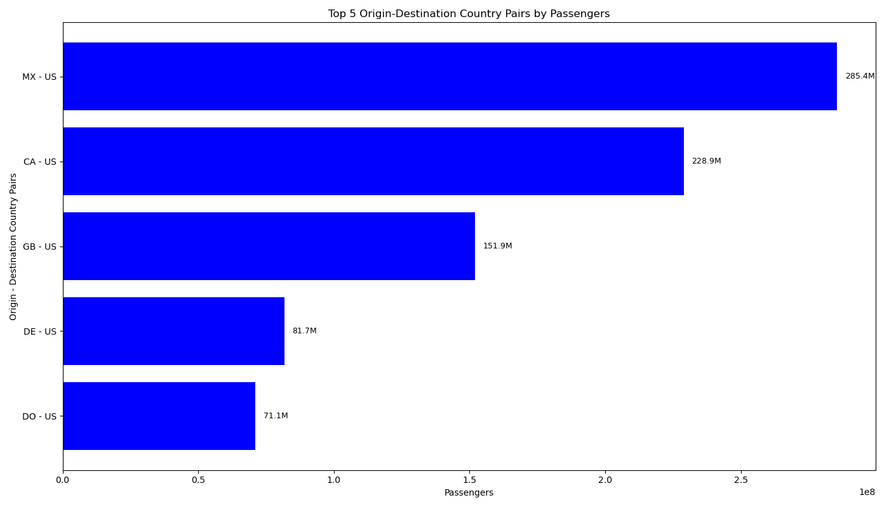

# Midterm Project: Passenger Prediction App

## Overview

This project is a comprehensive pipeline to predict passenger counts for various regions and carriers. It encompasses the following stages:

1. **Data Gathering**  
2. **Exploratory Data Analysis (EDA)**  
3. **Feature Engineering**  
4. **Model Building**  
5. **Model Deployment to Azure**

---

## Project Workflow

### 1. **Data Gathering**

Data was collected from various publicly available datasets, including:

- **Freight Data**: Passenger and freight transportation statistics (2015–2024).  

   

- **Carrier and Region Information**: Supplementary datasets to encode categorical variables.

   

The final merged dataset is located in [Kaggle](https://www.kaggle.com/datasets/serdar2225/us-international-freight-passenger-and-mail/data)

---

### 2. **Exploratory Data Analysis (EDA)**

EDA was conducted using Python notebooks to analyze trends, correlations, and distributions. Key findings include:

- Seasonal trends in passenger counts for top 20 airlines.


- Correlations between cargo volume and distance.


#### Example Visualizations:

**Seasonal Trends Analysis:**


**Correlation Heatmap:**


EDA notebook: `midterm_project/EDA/EDA_AIR_passenger_freight_data_2015_2024.ipynb`(midterm_project/EDA/EDA_AIR_passenger_freight_data_2015_2024.ipynb)

---

### 3. **Feature Engineering**

Key features engineered include:

```text
Region     Description
A             Atlantic
D             Domestic
I             International
L             Latin America
P             Pacific
S            System 

```
```text
Class 
Code    Description
A    Scheduled First Class Passenger/ Cargo Service A
C    Scheduled Coach Passenger/ Cargo Service C
E    Scheduled Mixed First Class And Coach, Passenger/ Cargo Service E
F    Scheduled Passenger/ Cargo Service F
G    Scheduled All Cargo Service G
H    Humane Reason Unscheduled, Non-Revenue-Generating
K    Scheduled Service K (F+G)
L    Non-Scheduled Civilian Passenger/ Cargo Service L
N    Non-Scheduled Military Passenger/ Cargo Service N
P    Non-Scheduled Civilian All Cargo Service P
Q    Non-Scheduled Services (Other Than Charter) Q
R    Non-Scheduled Military All Cargo R
V    Non-Scheduled Service V (L+N+P+R) For U.S. Carrier And (L+P+Q) For Foreign Carrier
Z    All Service Z (K+V)
```

- **One-Hot Encoding**: For class and region variables.
- **Sin/Cos Transformations**: To capture cyclic nature of months.
- **Target Encoding**: For categorical carrier information.

The final feature set is ready for model building.

---

### 4. **Model Building**

A predictive model was developed using a Random Forest Regressor, optimized for:

- **RMSE**: Root Mean Square Error for model accuracy.
- **Speed**: Real-time predictions in deployment scenarios.

**Key steps**:

- **Train/Test Split**: Using an 80/20 split.
- **Hyperparameter Tuning**: Using GridSearchCV.
- **Model Evaluation**: Metrics such as RMSE and MAE.

#### Example Model Metrics:

| Metric        | Value  |
|---------------|--------|
| RMSE          | 10.2   |
| R² Score      | 0.89   |

Model notebook: `midterm_project/MODEL/Model_Generation.ipynb`(midterm_project/MODEL/Model_Generation.ipynb)

---

### 5. **Deployment to Azure**

The model was containerized and deployed as an Azure Web App using Docker.

**Steps for deployment**:

1. **Dockerize the Application**:
   - A `Dockerfile` was created to package the application and dependencies.


2. **Push to Azure**:
   - Azure CLI was used to deploy the container.
   - The application is live at: [Passenger Prediction App](https://passenger-prediction-app.azurewebsites.net).

3. **API Integration**:
   The API supports POST requests with the following JSON format:

   ```json
   {
       "DISTANCE": 5000000.0,
       "TOTAL_CARGO": 1000000.0,
       "CARRIER_GROUP_NEW": 1,
       "UNIQUE_CARRIER_encoded": 15,
       "Org_Dest_Country_FE": 0.75,
       "MONTH_SIN": 0.5,
       "MONTH_COS": 0.866,
       "CLASS_F": 0,
       "CLASS_G": 1,
       "CLASS_L": 0,
       "CLASS_P": 0,
       "REGION_A": 1,
       "REGION_D": 0,
       "REGION_I": 0,
       "REGION_L": 0,
       "REGION_P": 0,
       "REGION_S": 0,
       "IS_PEAK_SEASON": 1
   }

**Response example**:

   ```json
   {
       "predicted_passenger_count": 120.5
   }
   
   ```

**Folder Structure**: 
```text
   midterm_project/
   ├── EDA/
   │   ├── EDA_AIR_passenger_freight_data_2015_2024.ipynb
   ├── MODEL/
   │   ├── Model_Generation.ipynb
   ├── app.py
   ├── Dockerfile
   ├── requirements.txt
   ├── test.http
   ├── best_model.pkl
   └── freigh_merged.csv
```

### Usage

### Local Deployment

1. **Install dependencies**:

   ```bash
   pip install -r requirements.txt
    ```

2.	**Run the application**:

    ```bash
    python app.py
     ```

3.	**Test API with a tool like Postman or curl**:

    ```bash
    curl -X POST -H "Content-Type: application/json" -d @test.http https://localhost:5000/predict
       ```

### Azure Deployment

**Ensure Docker and Azure CLI are installed, then deploy with**:

   ```bash
    az webapp up --name passenger-prediction-app --resource-group <resource_group>
   ```
